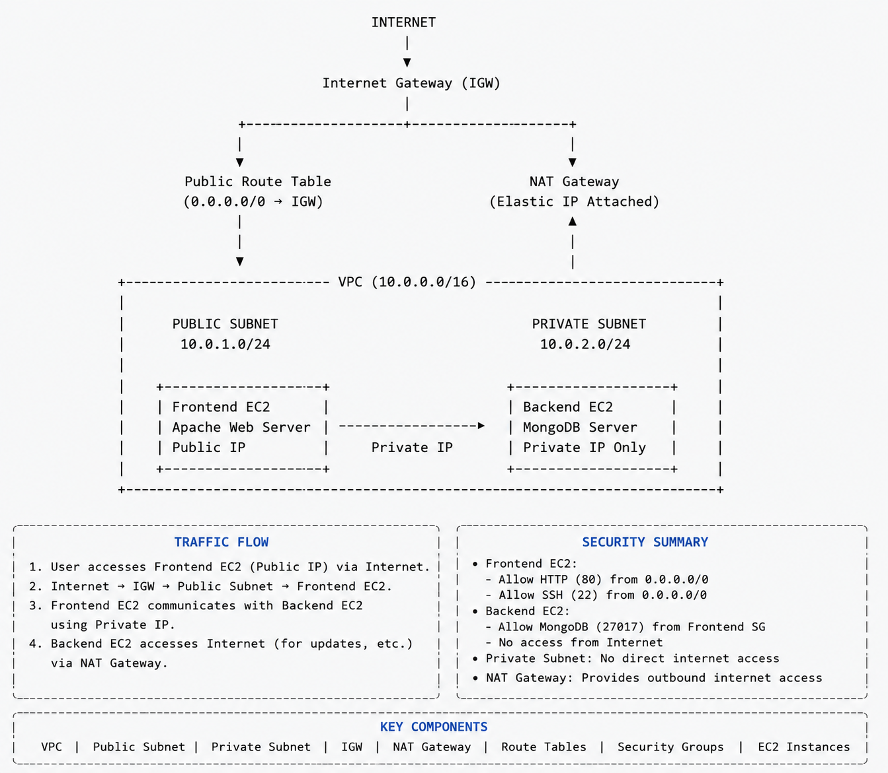

# Terraform AWS DevOps Infrastructure

This project provisions a secure AWS infrastructure on Amazon Web Services (AWS) using Terraform following Infrastructure as Code (IaC) principles.

The infrastructure consists of a frontend Apache web server hosted in a public subnet and a backend MongoDB server hosted in a private subnet. The backend is isolated from direct internet access while maintaining outbound connectivity through a NAT Gateway.

---

## Architecture

<p align="center">
  
</p>

---

## AWS Services Used

- Amazon VPC
- Amazon EC2
- Public & Private Subnets
- Internet Gateway
- NAT Gateway
- Elastic IP
- Route Tables
- Security Groups
- Amazon Linux 2023
- Terraform

---

## Features

- Infrastructure as Code (Terraform)
- Secure VPC Architecture
- Public & Private Subnet Design
- Internet Gateway for Public Resources
- NAT Gateway for Private Subnet Internet Access
- Frontend Apache Web Server
- Backend MongoDB Server
- Security Group Based Access Control
- Terraform Outputs

---

## Project Structure

```text
terraform/
├── provider.tf
├── ami.tf
├── vpc.tf
├── subnet.tf
├── igw.tf
├── nat-gateway.tf
├── private-route-table.tf
├── security-group.tf
├── ec2.tf
├── output.tf
└── .terraform.lock.hcl
```

---

## Deployment

```bash
terraform init
terraform fmt
terraform validate
terraform plan
terraform apply
```

---

## Author

**Pritam Priyanshu Patra**

GitHub: https://github.com/PritamPriyanshuPatra2003
